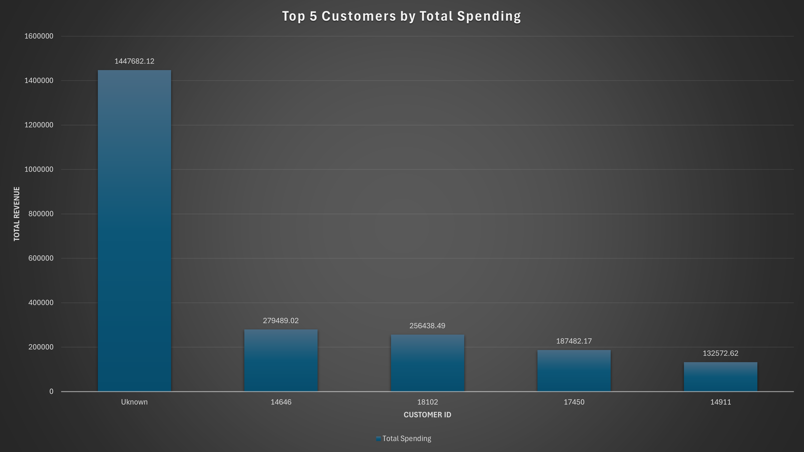
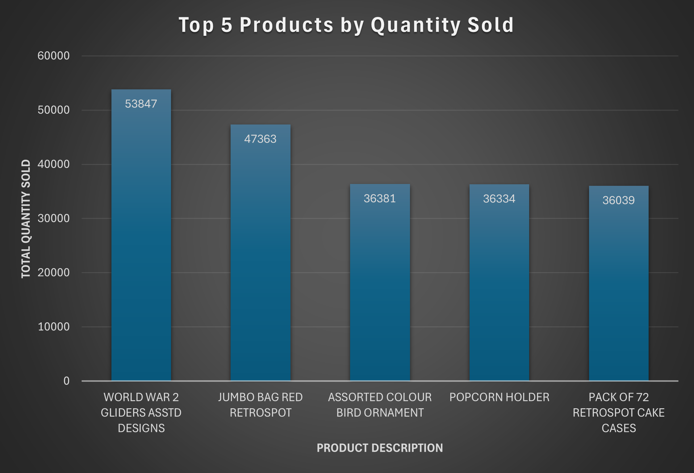
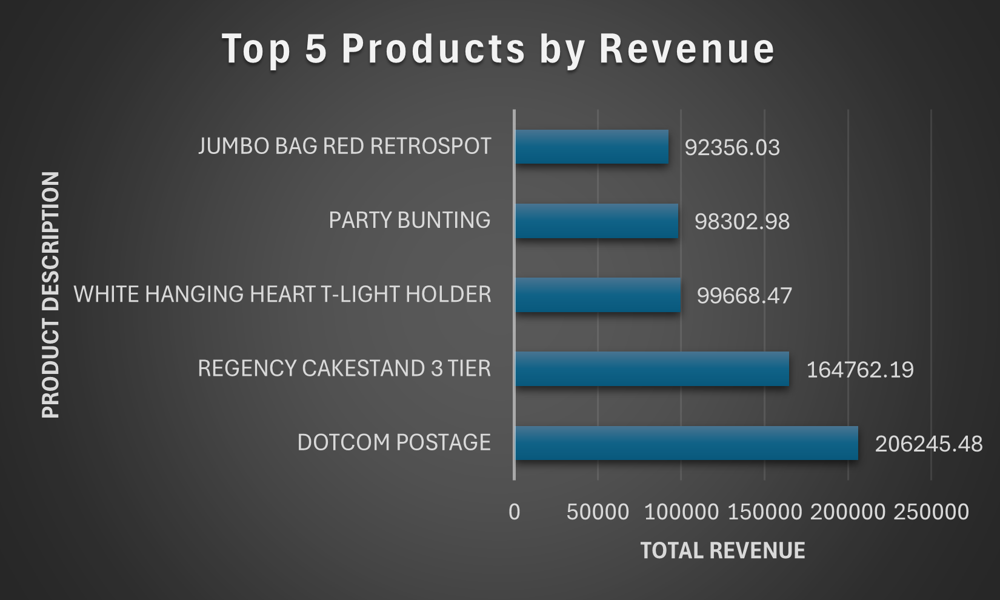
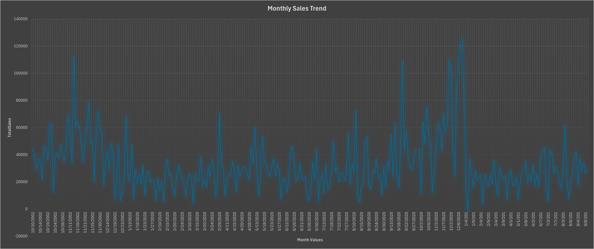
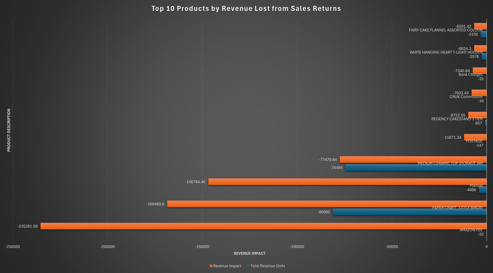

# Retail Sales Analysis Using SQLite

**Author:** Kyle Kraus  
**Email:** kkraus200@gmail.com  
**LinkedIn:** [Kyle Kraus](https://www.linkedin.com/in/kyle-kraus-490430229)  

---

## Project Overview
This project analyzes a retail dataset (~500,000 rows) to uncover insights that inform business decisions regarding products, customers, and sales trends.  

Key objectives include:  
- Identifying top-selling products by quantity and revenue  
- Highlighting high-value customers  
- Tracking monthly and seasonal sales trends  
- Detecting products with high return volumes  

The project demonstrates skills in **data cleaning, database management, SQL querying, and visualization** to generate actionable business insights.

---

## Dataset
- **Source:** Online Retail dataset (UCI Machine Learning Repository)  
- **Format:** CSV UTF-8 (`retail_data.csv`)  
- **Columns:** InvoiceNo, StockCode, Description, Quantity, InvoiceDate, UnitPrice, CustomerID, Country  
- **Rows:** ~500,000  

### Data Preparation
- Excel → CSV conversion  
- Missing CustomerIDs flagged but retained  
- Negative quantities separated for return analysis  
- Standardized text and numeric fields for consistency  
- Generated additional columns like `TotalRevenue = Quantity * UnitPrice`  
- Extracted Year-Month from `InvoiceDate` for time-series analysis  

---

## Tools Used
- **SQLite:** Database creation, querying, and aggregation  
- **Excel:** Data cleaning, CSV conversion, and visualization  
- **SQL:** Aggregation, grouping, filtering, and analysis  

---

## How to Run
1. Open SQLite.  
2. Import `retail_data.csv`.  
3. Run queries in `analysis.sql`.  
4. View visualizations in the `charts/` folder for insights.  

---

## Key Insights
- A handful of **best-selling products** and **top customers** drive most of the revenue.  
- **Daily and monthly sales** fluctuate significantly, reflecting promotions, holidays, and seasonal trends.  
- **High return products** negatively impact revenue, highlighting areas for improvement.  
- Targeted strategies for high-value customers and popular products can optimize revenue and operations.  

---

## Key Visualizations

### Top 5 Customers by Total Spending

### Top 5 Products by Quantity Sold

### Top 5 Products by Total Revenue

### Monthly Sales Trend

### Returns / Negative Quantities

---

## Full Project Report
For a detailed write-up of the analysis and charts, see the [PDF report](Retail_Sales_Analysis_Report.pdf).